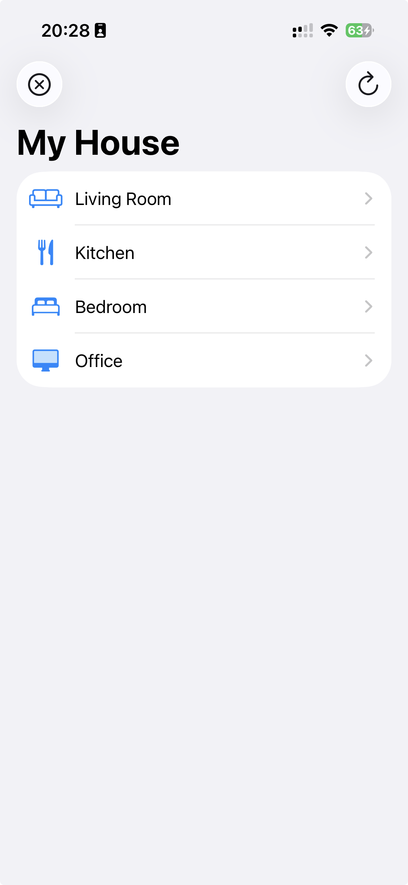
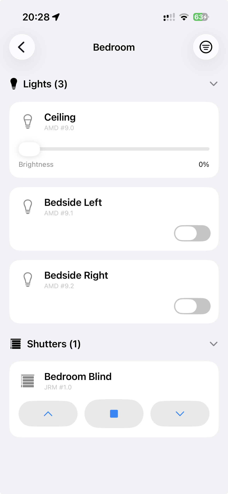

# PHC Remote

A modern, iPad-friendly iOS app to control a **PEHA / Honeywell PHC**
(Peha Home Control) electrical installation over the local network.

<p align="center">
  
  &nbsp;&nbsp;
  
</p>

It is a from-scratch replacement for the aging official
[*PHC Home Control*](https://apps.apple.com/de/app/phc-home-control/id1141475941)
app, which talks to a networked **STM v3** control unit but was never laid out
for larger displays.

> Status: **working against real STM v3 hardware.** Connects, downloads and
> parses the installation, and controls lights, outlets, and shutters with live
> state polling. See [docs/PROTOCOL.md](docs/PROTOCOL.md) for the wire protocol.

## How it works

```
┌────────────┐   Wi-Fi / LAN     ┌──────────────┐   RS-485 bus   ┌──────────────┐
│  iPhone /  │ ────────────────► │   STM v3     │ ─────────────► │ AMD/EMD/JRM  │
│   iPad     │  XML-RPC / 6680   │ (Steuermodul)│   PHC modules  │ output/input │
└────────────┘                   └──────────────┘                └──────────────┘
```

The iPhone never touches the RS-485 bus. It speaks the STM v3's XML-RPC-over-HTTP
protocol (port 6680, no auth on the LAN); the STM relays commands onto the bus
and reports module state back.

## Features

- **Floors → devices**, grouped into **collapsible categories** (Lights,
  Shutters, Outlets, …), sorted by name within each. Expand All / Collapse All.
- **Lights & outlets:** on/off, with state **polled every 2.5 s** so the app
  reflects physical switches too.
- **Shutters:** up / stop / down via simulated rocker input (PHC shutters have
  no position feedback, so the app shows only a brief "command sent" hint).
- **Instant relaunch:** the project is **cached on disk** per STM host; launches
  skip the ZIP download. "Reload from STM" forces a refresh after the
  installation changes.
- **Bilingual UI:** English + German (menu labels only; device/floor names come
  from the installation).
- iPhone uses a navigation stack; iPad a sidebar/detail split. App icon included.

## Architecture

The (reverse-engineered) wire protocol is isolated behind one interface:

- `PHCClient` — transport abstraction (connect, load project, power/shutter
  commands, register/poll, live state stream).
- `STMv3Client` — the **real** XML-RPC transport over HTTP. Downloads the project
  ZIP via chunked `readFile`, extracts it with **ZIPFoundation**, parses
  `project.ppfx`, drives `sendTelegram` (lights/outlets) and `simInputEvent`
  (shutters), and polls AMD module state.
- `MockPHCClient` — in-memory fake for development, previews, and Demo Mode.
- `HomeStore` — `@Observable`, transport-agnostic; optimistic updates, live
  event folding, and the disk project cache (`ProjectCache`).
- SwiftUI views (`ConnectionView`, `HomeView`/`FloorView`, `DeviceCard`).

See [docs/ARCHITECTURE.md](docs/ARCHITECTURE.md).

## Building

This repo contains the Swift sources and an [XcodeGen](https://github.com/yonaskolb/XcodeGen)
`project.yml`. On a Mac with Xcode 16+:

```sh
brew install xcodegen   # one time
xcodegen generate       # creates PHCRemoteControl.xcodeproj
open PHCRemoteControl.xcodeproj
```

Xcode resolves the one SPM dependency (**ZIPFoundation**) automatically. Pick a
simulator and Run — no STM required (boots against the mock with a sample home).
To run on a real iPhone, set your signing Team in the target's
Signing & Capabilities. To control real hardware, choose "Connect to STM" on the
first screen and enter the STM's LAN IP.

## Roadmap

1. ✅ Runnable UI skeleton against a mock backend.
2. ✅ Protocol decoded (XML-RPC `service.stm.*`, port 6680) by decompiling the
   PHC Systemsoftware and packet-capturing the official app.
3. ✅ `STMv3Client` working on real hardware: project download + ZIP extraction,
   lights/outlets, shutters, and state polling.
4. ✅ Project persisted on disk for instant startup.
5. ✅ German localization (menu labels).
6. ⏳ Scenes, favourites, off-LAN access. (Dimmers are **not** supported — see
   [docs/DIMMERS.md](docs/DIMMERS.md); the slider is Demo-Mode only.)

## Privacy

Your installation export (`project/`, `*.zip`) and any proxy captures are
**gitignored** and must not be committed — they describe your home's layout.

## License

PHC Remote is licensed under the **GNU Affero General Public License v3.0**
(AGPL-3.0) — see [LICENSE](LICENSE). In short: it's open source, and derivatives
— including modified versions made available to users over a network — must
remain open under the same license. This repository is the corresponding source,
which also satisfies the license's source-availability requirement for any
built or sideloaded copy.

Bundled third-party components keep their own permissive licenses —
**ZIPFoundation** (MIT), **Mono Icons** (MIT), and **Material Design Icons /
Pictogrammers** (Apache 2.0); full texts and attributions are in
[THIRD_PARTY_NOTICES.md](THIRD_PARTY_NOTICES.md).
