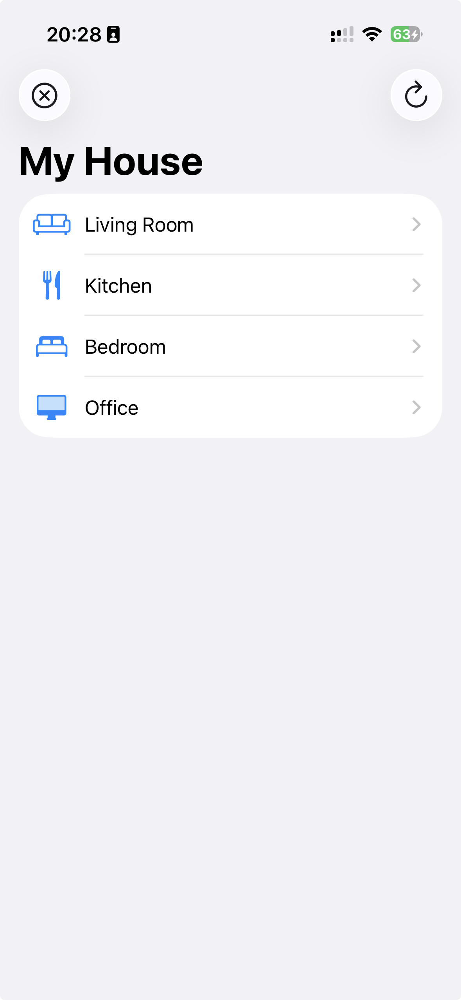
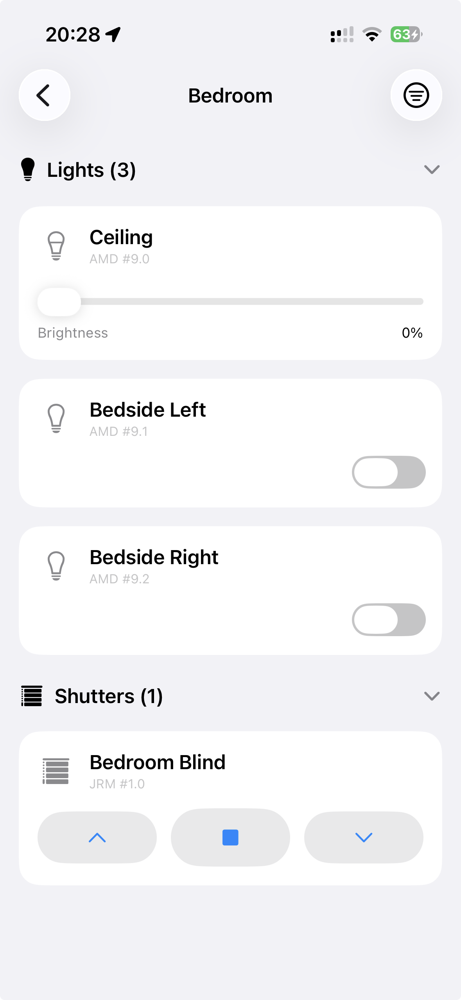

# PHC Remote

PHC Remote is a replacement for the aging official
[*PHC Home Control*](https://apps.apple.com/de/app/phc-home-control/id1141475941)
app for PEHA/Honeywell PHC installations with an STM v3 control unit.

This repository contains **two independent clients**:

1. A native SwiftUI app for iPhone and iPad. It connects directly to the STM.
2. A Go bridge for a Raspberry Pi. It connects to the STM and serves a local
   website for phones, tablets, and desktop browsers.

The iOS app does not use the Go bridge. Each client independently downloads and
parses the PHC project, sends commands, polls readable state, and maintains its
own cache and favourites.

<p align="center">
  
  &nbsp;&nbsp;
  
</p>

## Status

- The native iOS app works end to end against the real STM v3 installation.
- The Go website bridge implements project loading, commands, state polling,
  caching, its browser UI/API, and Raspberry Pi systemd packaging. Its
  read-only transport, project download, and AMD polling paths have been used
  against the real STM. Command encoding is kept in parity with the
  hardware-verified Swift implementation through shared fixtures.
- Real dimmers remain unsupported because this installation has no dimmer
  modules available to verify addressing, scaling, and feedback. Demo Mode has
  simulated dimmers.

The STM protocol is documented in [docs/PROTOCOL.md](docs/PROTOCOL.md).

## The two clients

```text
Native client                              Website client

┌──────────────────┐                       ┌──────────────────┐
│ iPhone / iPad    │                       │ Any LAN browser  │
│ SwiftUI app      │                       └────────┬─────────┘
└────────┬─────────┘                                │ HTTP / SSE
         │ STM XML-RPC                              ▼
         │ port 6680                       ┌──────────────────┐
         │                                 │ Go bridge on Pi  │
         │                                 └────────┬─────────┘
         │                                          │ STM XML-RPC
         │                                          │ port 6680
         └──────────────────┐   ┌────────────────────┘
                            ▼   ▼
                       ┌──────────────┐
                       │    STM v3    │
                       └──────┬───────┘
                              │ PHC bus
                              ▼
                       AMD / EMD / JRM
```

Both clients expose:

- AMD lights and outlets, including unknown visible AMD outputs as light-style
  controls;
- paired EMD shutters and motorized windows;
- virtual/central scenes and selected panic or presence-simulation TPFX tools;
- otherwise-unclassified visible EMD inputs as short- and long-press buttons;
- optional experimental jalousie slat nudges when project naming indicates a
  venetian blind;
- English and German UI chrome, ordered favourites, collapsible categories,
  and confirmation before panic/security actions.

Only AMD relay outputs have readable state. Shutters, windows, scenes, tools,
and fallback inputs can acknowledge command dispatch but cannot report their
position, movement, or resulting automation state.

## Repository structure

```text
Sources/                         Native iOS application
Tests/PHCRemoteControlTests/     Swift fixture/parity tests
bridge/                          Standalone Go website bridge module
protocol-fixtures/               Shared parser and command contracts
docs/                            Protocol, architecture, and research notes
project.yml                      XcodeGen definition for app and test targets
```

### Native iOS app: `Sources/`

The Swift app is organized around a transport boundary. Views send intents to
`HomeStore`; the store works with either the real `STMv3Client` or the in-memory
`MockPHCClient` through the `PHCClient` protocol.

```text
SwiftUI views
     │ observe / send intents
     ▼
HomeStore ───────────────► ProjectCache
     │ PHCClient
     ├───────────────────► MockPHCClient
     └───────────────────► STMv3Client ─────► STM v3
```

- `Sources/PHCRemoteControlApp.swift` is the app entry point. It chooses the
  real or demo client from `ConnectionView` and installs the resulting
  `HomeStore` into the SwiftUI environment.
- `Sources/Models/` contains the transport-independent project model: channel
  references, devices and states, floors (the model type is still named
  `Room`), stable identities, shared keywords, and EMD input-event plans.
- `Sources/Client/PHCClient.swift` defines the async client interface used by
  the store and views.
- `Sources/Client/STMv3Client.swift` implements XML-RPC over HTTP, calls
  `whoAreYou` to check reachability, downloads the archive through repeated
  `readFile` calls, extracts PPFX/TPFX with ZIPFoundation, sends commands, and
  polls AMD state every 2.5 seconds.
- `Sources/Client/PHCProjectParser.swift` parses visible PPFX channels and the
  supported TPFX tool subset into the app model. It classifies AMD outputs,
  pairs directional EMD motor inputs, creates scenes, and preserves unknown EMD
  inputs as fallback buttons.
- `Sources/Client/MockPHCClient.swift` and `SampleProject.swift` provide Demo
  Mode and SwiftUI preview data, including simulated shutter travel.
- `Sources/Client/PHCTelegram.swift` and `PHCFunctions.swift` preserve raw PHC
  bus framing/command research. They are reference utilities; normal app
  control uses the STM's higher-level XML-RPC methods.
- `Sources/Store/HomeStore.swift` is the `@MainActor`, `@Observable` application
  state. It loads cached projects, connects the client, registers pollable
  devices, folds live events into the model, performs optimistic UI updates,
  executes commands, and persists per-host favourite order.
- `Sources/Store/ProjectCache.swift` stores a per-host JSON project in
  Application Support and excludes the directory and files from iCloud backup.
- `Sources/Views/` contains the connection screen, adaptive iPhone/iPad
  navigation, floor/category layout, device cards, and acknowledgments.
- `Sources/Assets.xcassets` and `Sources/Localizable.xcstrings` contain the app
  artwork and English/German localization resources.

More detail is available in [docs/ARCHITECTURE.md](docs/ARCHITECTURE.md).

### Go website bridge: `bridge/`

The Go code is a separate module and executable. The production binary owns STM
communication, the parsed project and live state, and the browser-facing HTTP
server.

```text
browser ── HTML/JSON/SSE ──► web ──► controller ──► stm ──► STM v3
                               │          ▲
                               │          │
                            domain     project
                               ▲          │
                               └──── cache┘
```

- `bridge/cmd/phc-bridge/` composes and runs the production service. It serves
  immediately from the parsed-project cache (or an empty project), loads a
  fresh project in the background, and replaces the active controller after a
  successful reload.
- `bridge/cmd/stm-probe/` is a redacted diagnostic for STM identity, malformed
  HTTP responses, project download/parsing, and read-only state latency.
- `bridge/internal/domain/` defines the normalized project and hardware-derived
  stable IDs shared by the parser, controller, cache, and web layers.
- `bridge/internal/stm/` contains the typed STM client, the small XML-RPC codec,
  and the `net.Conn` wrapper that removes the STM's one known malformed response
  header before Go's HTTP parser sees it.
- `bridge/internal/project/` downloads and bounds the chunked project ZIP,
  extracts PPFX/TPFX with Go's central-directory ZIP reader, and implements the
  Swift-parity project/tool parser.
- `bridge/internal/controller/` indexes devices, checks capabilities, translates
  actions into exact telegram/event sequences, serializes all STM calls through
  a command-priority scheduler, polls AMD modules, and publishes revisioned
  snapshots and events.
- `bridge/internal/web/` embeds and serves the Go templates, CSS, JavaScript, and
  logo. It provides server-rendered pages plus `/api/v1` JSON and SSE endpoints,
  browser-local favourites, live state updates, and same-origin mutation checks.
- `bridge/internal/cache/` atomically stores a mode-0600, STM-keyed normalized
  project for immediate startup without the STM.
- `bridge/packaging/` contains the example environment file and hardened
  `systemd` unit for Raspberry Pi deployment.

See [bridge/README.md](bridge/README.md) for operation and deployment details.

### Shared contracts and documentation

`protocol-fixtures/` contains synthetic project files, expected normalized
projects, and input-event plans. Both the Swift and Go test suites consume these
fixtures so their parsing, stable IDs, motor references, and command sequences
cannot silently diverge.

The main documentation is:

- [Protocol reference](docs/PROTOCOL.md)
- [Native app architecture](docs/ARCHITECTURE.md)
- [Dimmer research and limitations](docs/DIMMERS.md)
- [Implemented Go bridge design](docs/GO_WEBSITE_BRIDGE_PLAN.md)
- [Earlier broader bridge/PWA exploration](docs/GO_BRIDGE_PLAN.md)

## Build and run the native iOS app

The app targets iOS 17+ on iPhone and iPad. The Xcode project is generated from
`project.yml` and is intentionally not committed.

```sh
brew install xcodegen
xcodegen generate
open PHCRemoteControl.xcodeproj
```

Xcode resolves ZIPFoundation through Swift Package Manager. Run the
`PHCRemoteControl` scheme and choose either **Demo Mode** or **Connect to STM**.
Running on a physical device requires selecting an appropriate signing team.
The same scheme includes `PHCRemoteControlTests`.

## Build and run the Go bridge

The Go module currently declares Go 1.26.

```sh
cd bridge
go test -race -count=1 ./...
go vet ./...
go build ./...
```

For local development, choose one canonical browser origin and use it both in
the URL and bridge configuration:

```sh
go run ./cmd/phc-bridge \
  -stm 192.168.x.x:6680 \
  -listen 0.0.0.0:8080 \
  -origin http://phc-bridge.local:8080 \
  -state-dir ./state
```

The bridge deliberately has no user authentication. Do not expose it to the
internet; restrict its listen port to the trusted home LAN. Raspberry Pi
cross-compilation and systemd installation instructions are in
[bridge/README.md](bridge/README.md).

## Project loading and protocol

The clients send XML-RPC bodies to `http://<stm>:6680/`. There is no STM
authentication.

`service.stm.whoAreYou()` returns only STM identity. It does **not** return the
PHC project. The project is downloaded separately in chunks with:

```text
service.stm.readFile(0, chunkIndex, 1)
```

The chunks form a ZIP containing `project.ppfx`, `project.tpfx`,
`project.cpfx`, and a `.facl` file. Both clients parse PPFX and a deliberately
selected TPFX subset. CPFX is extracted by neither production parser because
there is no verified semantic model for it.

## Security and privacy

- STM communication and the website use plain HTTP on the trusted LAN.
- The STM has no authentication. The Go website also deliberately has no user
  authentication; any device that can reach it can inspect and control the
  installation.
- Browser Host, Origin, fetch-metadata, content-type, CSP, framing, and request
  size checks reduce browser-origin attacks but do not authenticate another LAN
  device.
- Real exports, captures, STM identities and addresses, cache files, and copied
  deployment environment files describe the installation and must not be
  committed. The relevant paths and formats are gitignored.

## License

PHC Remote is licensed under the **GNU Affero General Public License v3.0**
(AGPL-3.0); see [LICENSE](LICENSE).

Bundled third-party components retain their own licenses: ZIPFoundation (MIT),
Mono Icons (MIT), and Material Design Icons/Pictogrammers (Apache 2.0). Full
texts and attributions are in
[THIRD_PARTY_NOTICES.md](THIRD_PARTY_NOTICES.md).
